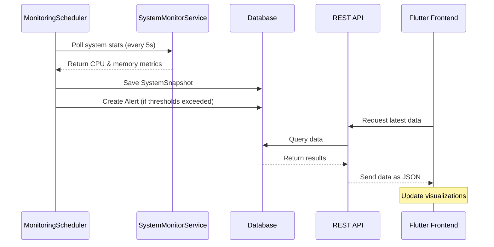

# NEUROSYS MONITOR | A Cross Platform System Monitoring Tool
<p><em>Advanced system monitoring made simple</em></p>
<div align="center">
  
  [](https://flutter.dev/)
  [](https://spring.io/projects/spring-boot)
  [](LICENSE)
  [](CONTRIBUTING.md)
</div>


## 🚀 Overview

NEUROSYS MONITOR is a lightweight full-stack application for real-time system performance tracking.
It features a sleek Flutter web frontend and a reliable Spring Boot backend, offering an easy and effective way to monitor system resources with clarity and speed.


Designed with simplicity and functionality in mind, it provides a smooth user experience without unnecessary complexity.

<div align="center">
<!--    -->
  

</div>

## ✨ Key Features

- **Real-time Metrics Visualization**: Monitor CPU, memory, and system performance with dynamic, responsive visualizations
- **Email Notification System** that sends automated alerts for critical resource usage, ensuring immediate awareness of system issues.


- **Intelligent Alert System**: Receive immediate notifications when systems exceed normal parameters
- **Historical Data Analysis**: Track performance trends over time with comprehensive data storage
- **User-friendly Interface**: Navigate through complex system data with an intuitive, futuristic UI
- **Cross-platform Support**: Deploy and access from any modern web browser
- **Threshold-based Monitoring**: Configurable alert thresholds for various system parameters
- **Low-resource Consumption**: Efficient backend with minimal impact on monitored systems

## 🔧 Technology Stack

### Frontend
- **Flutter Web**: Crafted with a responsive design to deliver a consistent experience across devices
- **Custom Animations**: Fluid transitions and micro-interactions to enhance user engagement
- **Reactive UI Components**: Real-time data updates without page refreshes
- **SVG Graphics**: Vector-based visualizations that scale perfectly on any display
- **State Management**: Efficient state handling for optimal performance

### Backend
- **Spring Boot**: Robust Java-based backend framework
- **JPA/Hibernate**: Streamlined database interactions
- **Scheduled Tasks**: Automated system polling at configurable intervals
- **RESTful API**: Clean API design for frontend-backend communication
- **Logging Framework**: Comprehensive logging for system operations and alerts
- **Repository Pattern**: Organized data access layer for maintainability

<!--
## 🏛️ Architecture

NEUROSYS MONITOR implements a clear separation of concerns with a three-tier architecture:

1. **Presentation Layer** (Flutter Web)
   - Responsive UI components
   - Data visualization
   - User interactions

2. **Application Layer** (Spring Boot Controllers & Services)
   - Business logic implementation
   - Scheduling and monitoring services
   - Alert generation

3. **Data Layer** (Repositories & Database)
   - System snapshot storage
   - Alert history
   - Performance metrics

<div align="center">
  
</div>

-->
## 🔍 How It Works

The system operates on a continuous monitoring cycle:

1. The `MonitoringScheduler` polls system statistics every 5 seconds
2. Current CPU and memory metrics are collected by the `SystemMonitorService`
3. Data is stored as `SystemSnapshot` entities in the database
4. Thresholds are evaluated to generate appropriate `Alert` entries
5. The frontend retrieves and visualizes this data through REST API calls
6. Real-time updates are pushed to the UI using WebSocket connections



## 🔔 Alert System

NEUROSYS implements a multi-level alert system to categorize issues by severity:

| Level | CPU Threshold | Memory Threshold | Action |
|-------|---------------|------------------|--------|
| Low | < 10% | < 30% | Info logging |
| Normal | 10-20% | 30-65% | Standard monitoring |
| Warning | 20-80% | 65-90% | Alert generation |
| Danger | > 80% | > 90% | Critical alert, database entry, & email notification |

## 🖥️ UI Components

The frontend features a suite of custom-designed components:

- **Landing Page**: Futuristic introduction with animated elements
- **Dashboard**: Central command center with real-time metrics
- **Alert Panel**: Chronological and severity-based alert visualization
- **System Overview**: High-level system health indicators
- **Performance Graphs**: Historical performance tracking with interactive charts


## 📊 Data Visualization

NEUROSYS MONITOR offers multiple visualization options for different monitoring needs:

- Real-time line charts for continuous metrics
- Gauge visualizations for utilization percentages
- Heat maps for identifying performance hotspots
- Timeline views for historical trend analysis

## 🚀 Getting Started

### Prerequisites

- Java 17 or higher
- Flutter SDK 3.10.0 or higher
- MySQL/PostgreSQL database
- Git

### Installation

1. **Clone the repository**
   ```bash
   git clone https://github.com/ShishirRijal/system-monitoring-project.git
   cd neurosys-monitor
   ```

2. **Set up the backend**
   ```bash
   cd backend
   ./mvnw spring-boot:run
   ```

3. **Set up the frontend**
   ```bash
   cd ../frontend
   flutter pub get
   flutter run -d chrome
   ```

4. **Access the application**
   Open your browser and navigate to `http://localhost:8080`

## 🛠️ Configuration

### Backend Configuration

Edit `application.properties` to configure database connections, logging levels, and monitoring intervals:

```properties
# Database Configuration
spring.datasource.url=jdbc:mysql://localhost:3306/neurosys
spring.datasource.username=root
spring.datasource.password=password

# Email Configuration (e.g., Gmail SMTP)
spring.mail.host=smtp.gmail.com
spring.mail.port=587
spring.mail.username=your.email@gmail.com
spring.mail.password=your_app_password
spring.mail.properties.mail.smtp.auth=true
spring.mail.properties.mail.smtp.starttls.enable=true
app.email.sender=your.email@gmail.com
app.email.receiver=recipient@example.com

```

 
 
 
## 📄 License

This project is licensed under the MIT License - see the [LICENSE](LICENSE) file for details.
 
---

<div align="center">
  <p>Built with ❤️ by Shisir Rijal</p>
</div>
